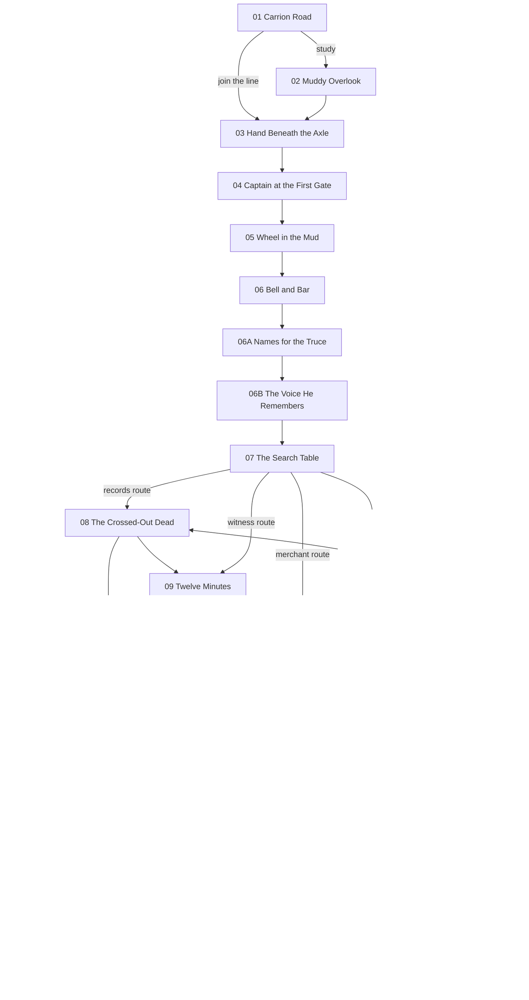

# Chapter One Beat Sheet - The Carrion Road

**Status:** Implementation-ready design draft for the Chapter One rewrite

**Scope:** 20 purposeful scenes, including four endings

**Target first-play time:** 20-30 minutes

**Rule:** Structure, consequence, and evidence logic come before dialogue expansion.

This beat sheet replaces the prototype's route logic as the design source of truth. It does not replace `data/chapters/chapter_01.json` yet. Implementation should translate these beats into story data without treating the prototype dialogue as fixed.

## Chapter promise

Garren Vale reaches a checkpoint three miles from home intending to pass unnoticed. By the end of the chapter, he must choose who will carry the truth of Red Hollow and accept that choosing a custodian also chooses a victim.

The chapter tests one question:

> If revealing the truth would begin another war, is the truth still worth protecting?

No ending answers that question cleanly. Each preserves something and makes Garren responsible for what is lost.

## Garren's Chapter One arc

- **Starting mask:** Garren calls himself a survivor and treats disengagement as neutrality. He wants to reach home without becoming useful to an army, a cause, or another frightened person.
- **Contradiction:** He despises the machinery that sacrificed his regiment, but his most reliable skills are the interrogator's skills that machinery taught him.
- **Pressure:** Meret can offer institutional shelter, Tavin can offer dangerous testimony, and Sella can offer practical escape. Each asks Garren to turn knowledge into leverage.
- **Revelation:** Red Hollow was not one forged order or one villain's decision. It required an authentic chain of obedience: a sealed countermand, a supply fiction, a delayed signal, and people who told themselves they had only done one small part.
- **Choice:** Garren must decide whether truth belongs with an institution, a witness, a broker, or no one.
- **End state:** He leaves the checkpoint as a custodian, accomplice, debtor, or destroyer. He can no longer claim that survival alone is morally neutral.

## Finalized principal cast

### Garren Vale - the reluctant custodian

- **Role:** Former military interrogator and the only person positioned to connect the surviving evidence without immediately being dismissed as a deserter, profiteer, or compromised officer.
- **Voice:** Clipped, concrete, and watchful. Garren notices tools, exits, hands, and omissions before feelings. His questions sound like statements with one missing fact. Dry humor targets institutions and himself. Under pressure he slips into an interrogator's cadence: narrow options, exact repetition, and deliberate silence. He does not announce an emotion when a counted detail can betray it.
- **Public goal:** Pass the checkpoint and go home.
- **Private need:** Prove that what he did in the war did not make him useful only when another person must be broken.
- **Loyalties:** To the dead soldiers whose names are being rewritten, and reluctantly to anyone who trusts him after learning what he was.
- **Fear:** If he takes responsibility for the truth, he will become an interrogator again under a more flattering name.
- **Self-deception:** A method is neither cruel nor merciful; only the information matters.
- **Secret:** Captain Orl gave him a sealed packet before the retreat. Garren suspected it could make him a target and carried it anyway, while telling himself he had never chosen a side.
- **Breaking point:** Being forced to choose between preserving a person and preserving proof. He stops observing and takes custody of the consequence.

### Captain Meret - the compromised authority

- **Role:** Commander of the checkpoint and the institutional path for containing, authenticating, or burying the evidence.
- **Public goal:** Execute the Crown's search order without losing control of the soldiers, refugees, or road.
- **Private need:** Discover whether the order she once authenticated helped murder Garren's regiment.
- **Loyalties:** First to the soldiers and civilians physically under her authority, then to lawful continuity; her crisis begins when the Crown makes those loyalties incompatible.
- **Fear:** Disorder will kill innocent people faster than bad authority will, and her attempt to resist quietly will cause the very panic she believes only discipline can prevent.
- **Self-deception:** Enforcing a lawful-looking order buys time without making her responsible for its purpose.
- **Secret:** At the rear depot, Meret authenticated the courier chain for the Red Hollow countermand without opening it. Her signature made the fatal order operational. The current checkpoint warrant carries the same imperfect counterseal, and she noticed before Garren arrived.
- **Breaking point:** A superior orders her to execute Tavin, burn the old ledger, and clear the road. She will falsify a record and turn against the order, but only if someone accepts the immediate civilian risk with her.

### Tavin - the guilty witness

- **Role:** The only living witness who saw the countermand delivered and can explain how it changed the battle.
- **Public goal:** Escape the checkpoint alive.
- **Private need:** Make someone credible say that his regiment was sacrificed so his own obedience is not the last surviving account.
- **Loyalties:** To the abandoned regiment and to the truth of the beacon delay, but survival can make him betray either a current ally or the cleanest version of that truth.
- **Fear:** Garren will extract the useful facts, discard the compromised witness, and call that justice.
- **Self-deception:** He deserted as soon as he understood the betrayal.
- **Secret:** Tavin was the signal runner ordered not to light the withdrawal beacon. He obeyed for twelve minutes before defying the countermand. The warning came too late, and he fled. His testimony proves intent and also proves his part in the delay.
- **Breaking point:** Garren uses the old interrogation methods or offers him to Meret as clean evidence. Tavin will then protect himself with a damaging lie, including exposing Garren's wartime methods.

### Sella Venn - the practical broker

- **Role:** Merchant, smuggler, and non-state route by which people or evidence can cross the checkpoint.
- **Public goal:** Get her wagon, license, and two displaced dependents through the gate.
- **Private need:** Believe she can protect people by pricing every risk accurately.
- **Loyalties:** To the dependents in her wagon and the informal trade network that keeps them fed; every wider cause remains negotiable until it threatens that shelter.
- **Fear:** One unprofitable act of conscience will destroy the small shelter she has built for others.
- **Self-deception:** She trades in cargo and information, never in lives.
- **Secret:** Tavin paid for passage with the stamped strap from the countermand courier's satchel. Sella anonymously tipped the checkpoint that a valuable deserter was coming, intending to trade his location for safe passage. She did not expect a summary execution order.
- **Breaking point:** Her dependents are threatened because Tavin is in her wagon. Unless Garren has made and kept a concrete promise, she will surrender Tavin before she sacrifices them. If he has kept it, she will burn her license and use her smuggling network for the truth.

## Red Hollow evidence trail

No single item proves the conspiracy. The accusation becomes credible only when different kinds of evidence corroborate one another.

| Evidence | What it establishes | Limitation and risk | Possible Chapter One state |
| --- | --- | --- | --- |
| **Captain Orl's sealed packet** | Contains Orl's cover note to Garren and a pressure-copy of the countermand that denied the regiment permission to withdraw. It bears the Chancellor's office counterseal. | A defense advocate could call the pressure-copy a field forgery. Possession marks Garren as a conspirator or thief. | Sealed with Garren; opened before Meret; surrendered; hidden with another custodian; burned. |
| **Tavin's testimony** | Connects the countermand to action: he saw the courier deliver it, received the order to suppress the beacon, and watched the reserves move away before the regiment was trapped. | Tavin is a deserter who initially obeyed and then fled. Coercion makes his account less reliable and gives him reason to lie. | Trusted; frightened; bargaining; captured; escaped; discredited; dead off-page only if a later chapter confirms it. |
| **The crossed-out ration folio** | Shows Garren's regiment removed from the active supply roll three days before Red Hollow while a replacement detail was provisioned under a false unit number. This proves administrative foreknowledge. | It proves planning, not who authored the plan. The checkpoint clerk can identify whoever copies or steals it. | Original retained; copied accurately; memorized incompletely; destroyed; left with Meret. |
| **The courier satchel strap** | Its Crown stamp and serial match the courier entry in the ration folio and the seal described by Tavin, corroborating that a real official courier carried the countermand. | Sella acquired it as payment from a deserter; possession can hang her for theft of royal property. | With Sella; pledged to Garren; shown to Meret; traded for passage; lost with the wagon. |
| **Meret's current search warrant** | Carries the same flawed counterseal as Orl's pressure-copy and specifically orders the packet, signalman, and old supply folio seized. It proves the cover-up is active. | It can be dismissed as a local copy unless Meret authenticates its chain. Her authentication implicates her in both orders. | Secret copy made; publicly repudiated; kept by Meret; sent onward; burned. |

### Evidence threshold

- **One proof:** Leverage, but easily dismissed.
- **Two independent proofs:** A credible accusation that can move one ally or faction.
- **Three proofs including either Tavin or Meret:** A publishable case likely to trigger arrests, reprisals, and renewed military mobilization.
- **Four or five proofs:** The truth becomes difficult to suppress, but everyone who handled it becomes identifiable.

The strongest evidence state is deliberately not a clean success state. More proof also means a wider trail leading back to Garren, Meret, Tavin, Sella, and the checkpoint refugees.

## Remembered state contract

Reconvergence must preserve choices through changed access, testimony, risk, and ending cost. These are narrative state categories, not visible morality scores.

The machine-readable vocabulary, allowed values, legacy migration keys, and reconvergence declarations live in [`data/schemas/chapter_01_state.json`](../data/schemas/chapter_01_state.json). Story effects and requirements must use that schema rather than inventing keys during dialogue implementation.

| State | Set by | Must pay off later |
| --- | --- | --- |
| `approach_intel` (`ditch`, `clerk`, or none) | Scenes 1-2 | Opens an escape or records option in Scenes 6, 8, or 13. |
| `tavin_status` and `tavin_trust` | Scenes 3, 5, 9, 13 | Changes where Tavin is questioned, whether his full confession is reliable, and whether Ending 2 is available. |
| `tavin_fear` | Scenes 3 and 9 | Causes a protective lie or public accusation against Garren at the final crisis. |
| `meret_trust` and `meret_suspicion` | Scenes 4, 7, 11 | Changes access to the warrant, Meret's response at her breaking point, and the cost of Ending 1. |
| `meret_guilt_named` | Scenes 4 or 11 | Can move Meret from obedience to falsification, but makes blackmail impossible to disguise as trust. |
| `sella_promise` and `sella_trust` | Scenes 5, 10, 13 | Determines whether Sella sacrifices Tavin, burns her license, or accepts the evidence in Ending 3. |
| `sella_tip_known` | Scene 10 | Lets Garren forgive, leverage, or expose Sella; changes Tavin's reaction at reconvergence. |
| Evidence custody states | Scenes 7-12 | Determine ending availability, the credibility of the surviving case, and who can be traced. |
| `public_method` (`restraint`, `deception`, or `coercion`) | Scenes 4, 6, 6B, 9 | Changes how the crowd and principal cast interpret Garren during Scene 13. |
| `march_families_warned` | Scene 6A | Changes how the Bracken families meet the clearing order and what their escape or detention spreads beyond the gate. |
| `interrogation_response` | Scene 6B | Changes civilian action and Garren's exposure during the crisis, then returns at the open-gate oath. |
| `evidence_distribution` | Scene 12 | Ensures no ending can silently consolidate evidence that the player deliberately split or surrendered. |
| `civilian_cost` | Scene 13 | Appears in every ending; the checkpoint crisis cannot vanish when the branch resolves. |

Every major state must change at least two later moments. A state that changes only one line should be folded into another state or removed.

## Route shape and timing

Each completed route contains 14-15 scenes, including an ending. Scenes 7-12 contain multiple dialogue turns and should carry most of the investigative playtime.

## Scene beats

### 01 - `ch01_carrion_road` - The Carrion Road above the checkpoint

- **Dramatic purpose:** Establish the hostile return, Garren's desire to remain unimportant, and the checkpoint as an obstacle built from war rather than a generic gate.
- **Characters and wants:** Garren wants to pass unnoticed. Meret, distant below, wants the line orderly. Sella wants her wagon to keep its place. Tavin wants to remain unseen beneath it.
- **Revealed or concealed:** The soldiers are searching discharged military traffic more carefully than civilians. Garren feels Captain Orl's sealed packet inside his coat but does not yet explain it. The specific search targets remain concealed.
- **Choice or pressure:** Join the line before the weather worsens, or spend time studying the checkpoint.
- **Immediate consequence:** Joining sets `approach_intel: none` and lowers initial suspicion. Studying branches to Scene 2 but risks being noticed.
- **Delayed consequence:** A cautious arrival makes Meret more willing to treat Garren as another tired veteran; visible surveillance makes the clerk remember him.
- **Destination:** Join -> Scene 3. Study -> Scene 2.
- **Environmental panel:** Wide road descending through black rain to a timber palisade; refugee line, broken carts, cages, and severe gate towers dominate. People are small silhouettes.
- **Garren revealed:** He measures exits and personnel without deciding to. The war remains in his attention even while he claims to be done with it.

### 02 - `ch01_muddy_overlook` - Optional rise above the drainage ditch

- **Dramatic purpose:** Reward observation with actionable access rather than exposition and foreshadow that the checkpoint has been prepared for specific prey.
- **Characters and wants:** Garren wants an advantage. Below, Meret wants her soldiers positioned without alarming the crowd; Sella wants no one to notice a hand beneath her wagon.
- **Revealed or concealed:** Garren sees a flooded drainage culvert, a clerk replacing the public search notice with a sealed private sheet, and one soldier watching Sella's wagon rather than the road. He cannot study everything before being seen.
- **Choice or pressure:** Memorize the culvert route (`approach_intel: ditch`) or study the clerk's document exchange (`approach_intel: clerk`).
- **Immediate consequence:** The chosen intelligence becomes available later; the unchosen detail remains only suspicion.
- **Delayed consequence:** The culvert can move a person but not a wagon. The clerk pattern can expose the old ledger but identifies Garren as someone who was watching.
- **Destination:** Both choices reconverge at Scene 3.
- **Environmental panel:** Checkpoint seen from high muddy grass, drainage water cutting along the palisade, figures reduced to strokes beneath rain and black pennants.
- **Garren revealed:** He chooses what kind of danger to understand: physical escape or institutional procedure.

### 03 - `ch01_axle_hand` - Sella's wagon in the refugee line

- **Dramatic purpose:** Incite the story by making the Red Hollow accusation personal and immediately costly.
- **Characters and wants:** Garren wants no recognition. Tavin wants concealment and a credible listener. Sella wants both men to stop turning her wagon into evidence.
- **Revealed or concealed:** Tavin identifies Garren and says Red Hollow was arranged, not lost. He knows Orl gave Garren a packet. Tavin conceals his role in the delayed beacon; Sella conceals that she tipped the checkpoint.
- **Choice or pressure:** Expose Tavin, hide him more securely, deny knowing him, or demand information before helping.
- **Immediate consequence:** Sets Tavin as captured, hidden, abandoned, or bargaining; adjusts `tavin_trust` and `tavin_fear`; changes how Sella reads Garren.
- **Delayed consequence:** Exposing him gives Meret leverage. Hiding him implicates Sella. Denial makes Tavin willing to name Garren publicly. Extracting a price makes later testimony conditional.
- **Destination:** All variants go to Scene 4, with Tavin either present, under guard, or concealed nearby.
- **Environmental panel:** Ground-level view beneath a bowed wagon: axle, boots, mud, pale hand, flour leaking from split sacking; faces remain outside the frame.
- **Garren revealed:** His first instinct is to decide whether a person is a witness, threat, or asset.

### 04 - `ch01_first_gate` - Inspection lane beneath the outer gate

- **Dramatic purpose:** Introduce Meret as a disciplined antagonist with doubts, not a simple jailer, and put Garren's official identity under pressure.
- **Characters and wants:** Meret wants to test Garren without starting a public arrest. Garren wants through. Tavin wants Garren not to validate the search. Sella wants the inspection to move past her wagon.
- **Revealed or concealed:** The warrant names an item sealed by Captain Orl and an unnamed signalman. Meret recognizes Garren's former occupation. She conceals that she recognizes the counterseal flaw and her own connection to it.
- **Choice or pressure:** Answer as an obedient veteran, lie about Orl, or quietly tell Meret the search order resembles Red Hollow.
- **Immediate consequence:** Sets `meret_trust`, `meret_suspicion`, and `public_method`. Naming Red Hollow can set `meret_guilt_named` early but sharply raises risk.
- **Delayed consequence:** Deference opens the quiet-bargain route but lets Meret define Garren publicly. A lie can protect the packet but gives Meret a contradiction to use. Naming guilt makes Meret either an ally under pressure or an enemy who believes she is being blackmailed.
- **Destination:** Scene 5.
- **Environmental panel:** Portcullis ribs overhead, rain pouring from timber, inspection trestle and ledger under a narrow awning; Meret is a dark upright figure seen from behind.
- **Garren revealed:** He can make another person's hidden fear visible with one sentence and knows exactly what that power costs.

### 05 - `ch01_wheel_in_mud` - Wagon caught between the gates

- **Dramatic purpose:** Give Sella independent leverage and force Garren to make or refuse the chapter's first concrete promise.
- **Characters and wants:** Sella wants the wagon freed before a full search. Garren wants movement and access to Tavin. Tavin wants not to be the cargo that gets discarded. Meret wants to observe whom Garren protects.
- **Revealed or concealed:** The wheel has exposed part of a false floor and old military ration marks. Sella admits Tavin paid for passage but does not reveal the satchel strap or her anonymous tip.
- **Choice or pressure:** Promise to get Sella's dependents and wagon through, threaten to expose the false floor, or pledge Orl's packet as collateral for her help.
- **Immediate consequence:** Sets `sella_promise`, `sella_trust`, or a coercive debt. The packet may become temporarily visible to Sella.
- **Delayed consequence:** A kept promise can carry people or evidence through Scene 13. A threat makes Sella sacrifice Tavin at her breaking point. Collateral gives Sella an ending route but reduces Garren's control of the proof.
- **Destination:** Scene 6.
- **Environmental panel:** Wagon wheel sunk to the hub between sharpened gates, many hands pushing in mud, torn canvas revealing the geometry of a false floor without showing its contents clearly.
- **Garren revealed:** A promise frightens him more than a threat because it creates a future version of himself who can fail.

### 06 - `ch01_bell_and_bar` - Checkpoint courtyard lockdown

- **Dramatic purpose:** First major reconvergence. Turn private suspicion into a closed-pressure system while preserving every earlier status.
- **Characters and wants:** Meret wants the gate sealed without a riot. Garren wants time. Tavin wants an escape or audience depending on status. Sella wants her wagon kept out of the soldiers' hands. The refugees want the road reopened.
- **Revealed or concealed:** A new order has arrived faster than normal travel allows, proving the search was anticipated. It commands the signalman, Orl packet, and old supply records held. The source of the tip remains concealed.
- **Choice or pressure:** Use the culvert knowledge, track the clerk's records, calm the crowd, or create a deception around the wagon. Options depend on `approach_intel` and prior method.
- **Immediate consequence:** Establishes the access Garren will use at the search table and may increase `civilian_pressure`. Earlier Tavin and Sella states change who helps or obstructs him.
- **Delayed consequence:** The crowd remembers restraint, deception, or coercion. Meret later has either space to defy her superior or a courtyard already primed to panic.
- **Destination:** All branches reconverge at Scene 6A.
- **Environmental panel:** Gate slammed shut, bell rope cut short, refugees compressed among wagons while soldiers close a ring; rain and palisade dominate the figures.
- **Garren revealed:** He applies crowd-control instincts and sees how easily care for people becomes management of people.

### 06A - `ch01_names_for_the_truce` - Reprisal roll beneath the inner gate

- **Dramatic purpose:** Make the threatened renewed war and its first civilian victims concrete before Garren chooses how to investigate the evidence.
- **Characters and wants:** Meret wants to delay a reprisal without openly refusing it. The Bracken families want to know why soldiers are sorting them by village. The Chancellor's courier wants the list operational before Red Hollow can become public. Garren wants time without accepting that silence also chooses victims.
- **Revealed or concealed:** The Chancellor's peace blamed the Bracken lords for Red Hollow. Orl's countermand would expose that story as a Crown lie and let those lords void the truce; their levies are one day west. The reprisal roll turns Bracken refugees inside Crown territory into ready hostages.
- **Choice or pressure:** Give Meret the list and make her delay the sorting, or warn the named families before soldiers can mark them.
- **Immediate consequence:** Quiet delay raises Meret's trust and lowers crowd pressure but leaves the families grouped for later seizure. Warning them raises Sella's trust and crowd pressure while giving the families a chance to move.
- **Delayed consequence:** The checkpoint crisis and its immediate aftermath remember whether the families were warned. Their detention, flight, or rumor can help keep the truce quiet or carry the accusation toward the Bracken levies.
- **Destination:** Both choices continue to Scene 6B.
- **Environmental panel:** Fresh reprisal roll pinned over a rain-bleached truce notice beneath the inner gate; soldiers divide hooded refugee families by village marks while severe timber and weather dominate the composition.
- **Garren revealed:** He learns that withholding dangerous truth is already an action with named bodies attached to it.

### 06B - `ch01_old_questions` - Registration bench beside the marked families

- **Dramatic purpose:** Confront Garren with a living casualty of his former interrogation work and make him decide whether an old weapon can serve mercy without owning another person.
- **Characters and wants:** Perrin Dask wants his daughter's confiscated travel slate returned and her name removed from the Bracken roll. The clerk wants to avoid correcting a ledger under scrutiny. Garren wants not to be useful only through coercion.
- **Revealed or concealed:** During the retreat, Garren questioned Dask for two nights until he named a brother who was already dead. The confession cleared Dask and left his brother recorded as a traitor. One blurred digit now makes Dask's daughter a prospective hostage.
- **Choice or pressure:** Break the clerk with the same repeated-question cadence, or teach Dask how to make the ledger contradict itself.
- **Immediate consequence:** Coercion returns the slate but exposes Garren's method and raises Meret's suspicion. Sharing the method lets Dask win the correction himself, increases Sella's trust, and encourages other families to challenge their marks. Both choices raise public pressure at different costs.
- **Delayed consequence:** At the clearing crisis, either the broken clerk identifies Garren to the superior or Dask's challenge occupies soldiers with disputed arithmetic. The open-gate oath remembers whether Garren kept the method as a private weapon or gave it away.
- **Destination:** Both choices continue to Scene 7.
- **Environmental panel:** Rain-slick registration bench beside the marked families; Dask's old wrist scars and his daughter's slate in the foreground, with Garren and the clerk distant behind wet timber and an iron grille.
- **Garren revealed:** He either repeats the method for a merciful purpose or gives the method away and accepts that he cannot control how people use it.

### 07 - `ch01_search_table` - Scarred table under the main awning

- **Dramatic purpose:** Expose the first evidence item and let the player choose which relationship or proof leads the investigation.
- **Characters and wants:** Meret wants to inspect Orl's packet without publicly owning its implications. Garren wants to keep the evidence from becoming Crown property. Tavin wants his account heard. Sella wants the search diverted from her floor.
- **Revealed or concealed:** The packet's outer cover is addressed to Garren. Inside are Orl's note and a pressure-copy of the countermand. The copied counterseal resembles the current warrant, but the remaining corroboration is still hidden.
- **Choice or pressure:** Follow the supply records, secure Tavin's full account, honor Sella's claim first, or confront Meret with her authentication mark.
- **Immediate consequence:** Sets `investigation_route` and determines which two of Scenes 8-11 the route visits. The packet can remain with Garren, sit under Meret's hand, or be concealed by Sella according to prior leverage.
- **Delayed consequence:** The chosen route decides which relationships deepen and which evidence remains hearsay at Scene 12. No route can collect every proof safely.
- **Destination:** Records -> Scene 8. Witness -> Scene 9. Merchant -> Scene 10. Authority -> Scene 11.
- **Environmental panel:** Wet possessions spread across a scarred table, sealed papers between knife and ink pot, brazier smoking in rain; hands and sleeves only.
- **Garren revealed:** He chooses not merely what to learn, but whose version of the truth deserves the first risk.

### 08 - `ch01_crossed_out_dead` - Clerk's loft and war ledger

- **Dramatic purpose:** Establish administrative foreknowledge and show that mass betrayal can look like tidy bookkeeping.
- **Characters and wants:** Garren wants corroboration. The clerk wants to survive by obeying whoever holds the room. Meret is present on the authority route and wants the folio found without being seen to help.
- **Revealed or concealed:** Garren's regiment was struck from the active ration roll three days before Red Hollow. A false replacement detail received its stores. The folio serial matches the courier entry but does not name the Chancellor.
- **Choice or pressure:** Steal the original folio, make a precise copy, or memorize the entries and leave no physical trace.
- **Immediate consequence:** Sets the ration evidence state. Theft is strongest and loudest; copying takes time and leaves the clerk able to identify Garren; memory is safer but incomplete.
- **Delayed consequence:** The original strengthens every public case but can strand civilians during the search for it. A copy requires Tavin or Meret to authenticate context. Memory can support a private bargain but not survive Garren's death.
- **Destination:** Records route -> Scene 9. Authority route -> Scene 12.
- **Environmental panel:** Cramped timber loft, shelves of swollen ledgers, roof leaks caught in ration bowls, one open folio crossed by a hard shaft of gray light.
- **Garren revealed:** He recognizes that paperwork can be an instrument of killing because he once trusted files more than frightened testimony.

### 09 - `ch01_twelve_minutes` - Drainage culvert or cage passage

- **Dramatic purpose:** Turn Tavin from a useful accuser into a culpable witness and test whether Garren repeats his old methods.
- **Characters and wants:** Tavin wants protection before confession. Garren wants a complete, reliable account. A nearby guard or the rising water imposes time pressure.
- **Revealed or concealed:** Tavin saw the countermand delivered, was ordered to suppress the beacon, obeyed for twelve minutes, then lit it too late and fled. He gave Sella the courier strap. He may conceal or distort details if frightened.
- **Choice or pressure:** Offer terms and accept an imperfect witness, use calibrated coercion to force the sequence, or promise Meret custody in exchange for formal testimony.
- **Immediate consequence:** Sets `tavin_trust`, `tavin_fear`, and testimony reliability. Coercion produces more detail now but contaminates it and triggers Garren's wartime reputation later.
- **Delayed consequence:** A trusted Tavin will risk the chapel route. A frightened Tavin protects himself with a lie or names Garren's victims during Scene 13. Promised custody strengthens Meret's route while making escape a betrayal.
- **Destination:** Records route -> Scene 12. Witness route -> Scene 10.
- **Environmental panel:** Two exclusive clean variants: a flooded stone-and-timber culvert with figures as reflections, or a narrow passage behind hanging cages with faces obscured by rain and bars.
- **Garren revealed:** He must decide whether truthful information obtained cruelly is still a truth he can ask others to trust.

### 10 - `ch01_false_floor` - Inside Sella's tilted wagon

- **Dramatic purpose:** Reveal Sella's evidence and betrayal together, preventing the merchant route from becoming a clean escape option.
- **Characters and wants:** Sella wants a binding arrangement before revealing her leverage. Garren wants the courier strap. Tavin, if present, wants to know who exposed the route. Sella's dependents want not to be discovered beneath merchant papers.
- **Revealed or concealed:** The strap matches the folio serial and Tavin's courier. Sella admits she tipped the checkpoint about a valuable deserter to buy safe passage, then hid him when she learned the order meant execution.
- **Choice or pressure:** Keep the promise and accept her terms, leverage the tip to take the strap, or expose her to Tavin and Meret.
- **Immediate consequence:** Sets `sella_tip_known`, changes `sella_trust`, and determines custody of the strap. Tavin's trust can fall even if Garren forgives her.
- **Delayed consequence:** A respected bargain opens Sella's network ending. Leverage makes her carry evidence only under debt. Exposure can save Garren's credibility with Tavin while guaranteeing Sella sacrifices him at the crisis.
- **Destination:** Witness route -> Scene 12. Merchant route -> Scene 11.
- **Environmental panel:** Tilted wagon interior built from crates, flour dust, wet blankets, and a lifted false floor; stamped leather lies small against worn timber, no close faces.
- **Garren revealed:** He sees his own self-deception in Sella's claim that pricing a betrayal makes it less personal.

### 11 - `ch01_merets_room` - Meret's dry room above the gate

- **Dramatic purpose:** Reveal Meret's culpability and give institutional containment a sincere, dangerous advocate.
- **Characters and wants:** Meret wants Garren to understand the risk of uncontrolled disclosure. Garren wants the current warrant and an answer about her loyalty.
- **Revealed or concealed:** Meret authenticated the Red Hollow courier chain. The present warrant uses the same flawed counterseal and orders the evidence destroyed after seizure. She has delayed its harshest clause by keeping it from her soldiers.
- **Choice or pressure:** Share a proof and ask her to preserve the chain, blackmail her signature into service, or offer silence in return for people and records leaving the gate.
- **Immediate consequence:** Sets `meret_guilt_named`, changes trust and suspicion, and can produce a copy of the current warrant. Blackmail gains access but hardens her against Garren personally.
- **Delayed consequence:** Trusted Meret will falsify the checkpoint record at her breaking point. Blackmailed Meret may still help but will ensure Garren is named as the coercer. A silence bargain opens the quiet ending while narrowing other evidence routes.
- **Destination:** Merchant route -> Scene 12. Authority route -> Scene 8.
- **Environmental panel:** Severe room above the gate: dry map wall, folded uniform, single narrow window over the wet crowd, warrant held near an unlit stove; characters seen from behind.
- **Garren revealed:** He can distinguish responsibility from malice, but must decide whether that distinction changes what he demands.

### 12 - `ch01_three_hands` - Supply canvas behind the inspection awning

- **Dramatic purpose:** Second major reconvergence. Assemble the route's partial case, make missing evidence visible, and distribute custody deliberately.
- **Characters and wants:** Garren wants a survivable truth. Meret wants a controlled chain. Tavin wants his testimony joined to proof. Sella wants no single seizure to destroy every bargaining chip. Presence and freedom vary by state.
- **Revealed or concealed:** The available items corroborate one another according to the evidence threshold. The group understands that three strong proofs can restart military mobilization. Missing route evidence remains missing rather than appearing for convenience.
- **Choice or pressure:** Consolidate proof with one custodian, split it so no one can erase the case, or create a decoy bundle while hiding the strongest item.
- **Immediate consequence:** Sets `evidence_distribution` and exact custody. Consolidation strengthens one ending and makes one arrest decisive. Distribution preserves more routes but exposes more people. A decoy buys time but makes later authentication harder.
- **Delayed consequence:** Ending text and future chapter access must respect every custody decision. A surrendered, destroyed, or unseen proof cannot reappear without an explicit recovery scene.
- **Destination:** Scene 13.
- **Environmental panel:** Sagging supply canvas in hard rain, several separated evidence objects on an upturned crate, three sets of hands never all touching the same item.
- **Garren revealed:** He accepts that protecting truth is a logistics problem involving fallible people, not a pure declaration.

### 13 - `ch01_clear_the_road` - Courtyard during the superior's order

- **Dramatic purpose:** Trigger every principal character's breaking point and convert investigation into irreversible public action.
- **Characters and wants:** Meret receives orders to execute Tavin, burn the ledger, seize Sella's wagon, and clear the refugees. Tavin wants to shout the accusation before he disappears. Sella wants her dependents out. Garren wants to prevent the order from choosing every cost for him.
- **Revealed or concealed:** The cover-up is willing to create visible casualties. Meret's quiet delay is over. Tavin's fear can produce a lie about Garren. Sella's kept or broken promise determines whether she cuts Tavin loose or gives him up.
- **Choice or pressure:** Hold Meret's line long enough to falsify the record, open the culvert for Tavin, force Sella's wagon through, or publicly destroy the warrant and make the crowd witness its contents.
- **Immediate consequence:** Determines `civilian_cost`, Tavin's freedom, the wagon's fate, Meret's command, and which custodians remain available. Earlier approach knowledge, promises, and public method alter success and harm.
- **Delayed consequence:** No branch escapes damage: refugees are detained or injured, a soldier refuses Meret, Sella loses her license, Tavin becomes hunted, or the Crown learns exactly who challenged the warrant.
- **Destination:** Scene 14 after the immediate crisis, with options filtered by living relationships and evidence custody.
- **Environmental panel:** Courtyard split by an opening gate and a panicked crowd, cage door, wagon, burning ledger basket, soldiers' pikes forming collapsing lines; principals remain small within the architecture.
- **Garren revealed:** He stops treating people and proof as separate problems and chooses which loss he will personally cause.

### 14 - `ch01_open_gate_oath` - Threshold beyond the checkpoint

- **Dramatic purpose:** Make the final choice about custody and cost rather than victory, then state what Garren is willing to become.
- **Characters and wants:** Garren wants the surviving choice to mean something. Meret wants authority to contain the blast. Tavin wants testimony carried beyond official reach. Sella wants truth made portable and useful. Any unavailable character is represented by the promise, proof, or absence left behind.
- **Revealed or concealed:** The player sees exactly which proofs and people survived the crisis. No new evidence appears. The likely political consequence of each custodian is stated without predicting a guaranteed outcome.
- **Choice or pressure:** Give the case to Meret's hidden record; flee toward the ruined chapel with Tavin; place it in Sella's trade network; or destroy the corroboration and save what people can still leave.
- **Immediate consequence:** Selects one of four endings. Tavin and Sella routes require their trust, availability, or an earlier binding debt; Meret's outcome worsens if she was blackmailed; fire remains available but cannot undo public knowledge already released.
- **Delayed consequence:** Sets Garren's Chapter Two identity: sanctioned accomplice, hunted witness-keeper, debtor to a broker network, or destroyer marked useful by the Crown.
- **Destination:** Meret -> Scene 15. Tavin -> Scene 16. Sella -> Scene 17. Fire -> Scene 18.
- **Environmental panel:** Gate half-open onto drowned fields at gray dawn, road dividing toward town, marsh chapel, and merchant track; foreground contains only discarded military insignia in mud.
- **Garren revealed:** He makes an oath through custody and action, not a heroic speech.

### 15 - `ch01_ending_quiet_record` - Ending: The Quiet Record

- **Dramatic purpose:** Resolve the institutional route as protection purchased with complicity.
- **Characters and wants:** Meret wants the evidence hidden in an authentic record she can reopen when disclosure will not cause an immediate massacre. Garren wants access and the people still at the gate kept alive.
- **Revealed or concealed:** Meret falsifies the seizure ledger and records Garren as a Crown informant. The strongest surviving proof enters her private chain; the public story remains intact.
- **Choice or pressure:** The ending reflects prior custody rather than offering another choice. A trusted Meret preserves more evidence; a blackmailed Meret names Garren more explicitly.
- **Immediate consequence:** The road opens under a quiet official fiction. Tavin is imprisoned, missing, or reluctantly protected according to state. Sella pays for any broken promise.
- **Delayed consequence:** Garren gains institutional access for Chapter Two, but the Crown now considers him useful and Meret can be destroyed by his next move.
- **Destination:** Chapter end.
- **Environmental panel:** Empty records room after rain, one false ledger entry drying beside a locked evidence box while the gate road shows through a narrow window.
- **Garren changed:** He becomes an accomplice in order to keep a future chance at truth and cannot pretend the compromise was imposed on him.
- **Cost statement:** People survive the checkpoint; the official lie survives with them.

### 16 - `ch01_ending_debt_in_rain` - Ending: A Debt in the Rain

- **Dramatic purpose:** Resolve the witness route as truth preserved at the price of immediate pursuit and collateral punishment.
- **Characters and wants:** Tavin wants the chapel network to hear his confession. Garren wants the testimony and proof to remain joined. Meret wants to limit the hunt she is now required to lead.
- **Revealed or concealed:** The evidence leaving with them is credible but incomplete according to route. Tavin's trust determines whether he confesses his twelve minutes or tells only the cleaner accusation.
- **Choice or pressure:** The ending reflects whether Garren earned testimony or coerced it.
- **Immediate consequence:** Garren and Tavin escape toward the ruined chapel. The checkpoint remains closed; Sella's wagon or Meret's command bears the cost of their opening.
- **Delayed consequence:** Chapter Two begins with a publishable accusation, a manhunt, and a witness who may expose Garren if fear outweighed trust.
- **Destination:** Chapter end.
- **Environmental panel:** Ruined chapel above a flooded marsh, two distant figures approaching while checkpoint torches spread behind them like a search line.
- **Garren changed:** He binds himself to a compromised witness instead of extracting the useful facts and walking away.
- **Cost statement:** The truth has a voice; everyone who helped it escape becomes punishable.

### 17 - `ch01_ending_merchants_price` - Ending: The Merchant's Price

- **Dramatic purpose:** Resolve the broker route as survival and circulation purchased by surrendering control of the truth.
- **Characters and wants:** Sella wants her dependents safe and the evidence divided across routes the Crown cannot close at once. Garren wants the case to survive without immediately becoming a banner for war.
- **Revealed or concealed:** Sella has buyers, printers, smugglers, and rivals rather than a neutral public. She will release pieces when leverage or protection requires it.
- **Choice or pressure:** The ending reflects whether Garren kept his promise or forced Sella with her tip. Trust creates partnership; leverage creates a debt she intends to reverse.
- **Immediate consequence:** The wagon passes with people and selected proofs hidden separately. Tavin is carried, traded to Meret, or left behind according to earlier state.
- **Delayed consequence:** Chapter Two gains covert routes and information access, but Sella chooses timing and recipients. A faction may learn enough to act before the public learns enough to judge.
- **Destination:** Chapter end.
- **Environmental panel:** Merchant wagon crossing a flooded causeway at dawn, cargo lashed under black canvas, checkpoint small behind it, multiple roads vanishing into fog.
- **Garren changed:** He accepts dependence on someone whose morality is transactional and becomes responsible for the promises securing her cooperation.
- **Cost statement:** The truth survives the gate; it becomes merchandise before it becomes justice.

### 18 - `ch01_ending_fire_keeps` - Ending: What the Fire Keeps

- **Dramatic purpose:** Resolve destruction as a defensible act of protection that also completes the cover-up.
- **Characters and wants:** Garren wants the immediate hunt to end. Meret wants the crowd spared. Tavin wants his dead believed. Sella wants the evidence removed from her wagon and dependents.
- **Revealed or concealed:** Physical proof can be burned, but spoken knowledge and observed defiance remain. The Crown still learns who returned and who hesitated.
- **Choice or pressure:** The ending reflects which evidence was already distributed; Garren cannot burn copies he chose to place elsewhere.
- **Immediate consequence:** Remaining corroboration burns. The gate opens once the search has nothing recoverable to find. Tavin's response ranges from silent departure to public condemnation.
- **Delayed consequence:** A new war is less likely to ignite now, but Red Hollow's dead lose their case. Meret or the Crown may recruit Garren as someone willing to destroy dangerous truth.
- **Destination:** Chapter end.
- **Environmental panel:** Brazier overturned in rain, black paper scraps dissolving into mud while refugees and soldiers face the same empty gate.
- **Garren changed:** He chooses living bodies over the dead's claim and recognizes the choice as destruction, not neutrality.
- **Cost statement:** The people at the checkpoint may leave; the lie becomes history.

## Implementation guardrails

- Treat each numbered scene as a dramatic unit that may contain several short narration or dialogue nodes. Do not pad the chapter by turning every sentence into a separate scene.
- Preserve the four investigation routes and their two-scene windows. A route should reveal a distinct combination of character and evidence, not cosmetic wording around the same facts.
- Do not expose numerical trust, fear, suspicion, or evidence thresholds to the player.
- At Scenes 6, 12, 13, and 14, write explicit variants for material prior states. Reconvergence is a shared location and pressure, not a state reset.
- Never restore destroyed, surrendered, or unobserved evidence without an authored recovery beat.
- Keep choices concise and motive-based. Avoid labels that imply mercy, cruelty, good, evil, truth, or cowardice as objective categories.
- Environmental panels remain clean artwork. Dialogue, captions, choices, and ending titles belong to the interface.
- Do not polish or expand prototype dialogue until the story schema and route validation can represent this structure reliably.
